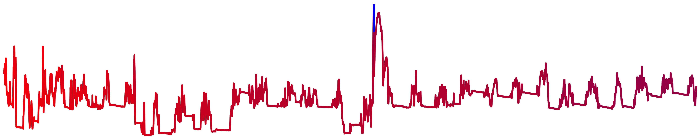

# Tools for Ecological Time Series (Tools4ETS)

[](https://www.repostatus.org/#active)

`Tools4ETS` is an `R` package which provides tools for ecological time series. This includes data exploration, time series processing, the computation of simple statistics from time series or models of time series and simulations to guide model-based ecological inference. `Tools4ETS` was motivated by analyses of new, high-resolution depth time series for a Critically Endangered elasmobranch. 



## Installation

You can install the development version of `Tools4ETS` from [GitHub](https://github.com) as shown below:

``` r
devtools::install_github("edwardlavender/Tools4ETS", dependencies = TRUE, build_vignette = TRUE)
```

To access the vignettes, use `vignette("Tools4ETS", package = "Tools4ETS")` for a general introduction to the package and `vignette("GAMS4DTS", package = "Tools4ETS")` for a specific introduction to the `GAMS4DTS()` function (see below). 

## Data visualisation

The `R` package [`prettyGraphics`](https://github.com/edwardlavender/prettyGraphics) was designed to complement `Tools4ETS` via the provision of tools for rapid time series visualisation in relation to covariates, across factor levels (e.g. individuals) and timescales with `prettyGraphics::pretty_ts()` and an interactive R Shiny application (`prettyGraphics::vis_ts()`). 

## Data processing

`Tools4ETS` streamlines common data processing operations for ecological time series. These include: 

* **Define time categories**. `hour_nearest()` and `hour_dbl()` define the nearest integer hour and the time of day respectively. `mmyy()` defines (ordered) month-year categories. `yday2date()` flicks from Julian days to dates/months/seasons. `yday_dbl()` defines the fraction of the year in days. 
* **Rates of change.** `difference()` and `serial_difference()` compute the difference between two values and consecutive pairs of values in a sequence (numbers or time stamps) respectively. 
* **Matching time series.** `match_ts_nearest()`, `match_ts_nearest_by_key()` and `pair_ts()` match time series (i.e., to add observations from one time series into another).  
* **Flagging time series.** `flag_ts()` can be used to flag independent sections of time series in a dataset due to the presence of different factor levels (e.g. individuals) and/or breaks in time series. Different flag types can be added, reflecting the requirements of different modelling approaches. `add_unit_id()` is used to add unique unit IDs to a time series. 
* **Thinning time series.** `thin_ts()`  can be used to thin a dataset, accounting for independent time series. `thin_ts_iter()` implements `thin_ts()` iteratively to explore the change in autocorrelation and data volume with thinning. `average_ts()` summarises a time series in bins. 
* **Breaking time series.** `break_ts()` can be used to induce breaks in time series. 

`Tools4ETS` includes additional functions designed specifically for processing depth time series, including the identification and description of recapture events (`suggest_recapture()` and `define_recapture()`) and the definition common covariates (e.g. via `define_photoperiod()`).

## Simple statistics

A few functions facilitate the computation of simple statistics from time series or models. These include: 

* **Calculate cumulative frequencies.** `cum_dates()` is used to calculate the cumulative number of events by each date in a time series. 
* **Estimating the strength of autocorrelation.** `estimate_AR1()` is used to estimate the autoregressive order 1 (AR1) parameter from the autocorrelation function (ACF) of a model's residuals. `acf_in_white_noise()` can be used to compute confidence intervals around an ACF. `estimate_AR1_with_k()` explores the effects of basis dimension on the residual autocorrelation for generalised additive models. 

## Simulations 

`Tools4ETS` advocates simulation-informed model-based inference; i.e, the use of simulations to explore the consequences of data structure, processing and modelling decisions for model performance and ecological inferences. 

This includes functions for simulating _de novo_ time series with known properties; namely: 

* **Dataframe assembly.** `assemble_ts()` can be used to simulate time series with time stamps for multiple factor levels (if applicable), possibly at different resolutions, over different durations and/or with breaks. 
* **Define parameters.** `parameterise_smooth()` can be used to define functions/parameters which relate covariates to a response and to compare simulated smooths to those inferred by GAMs. `sim_sine()` simulates and visualises periodic, sinusoidal functions.
* **Response simulation.** `sim_ts()` can be used to simulate the values of a response variable given a user-defined model. For simulations including residual autocorrelation, `sigma_arima()` facilitates the simulation of autocorrelated observations with known variance. 

A interactive application designed specifically to explore the use of GAMs as a tool for modelling depth time series (`GAMS4DTS()`) via the comparison of simulated datasets and model inferences under different conditions is included as well. 

`Tools4ETS` also includes functions which facilitate posterior simulation from generalised additive models (GAMs), a widely used modelling approach in ecology; namely:

* **Posterior simulation of expected values.** `simulate_posterior_mu()` can be used to simulate from the posterior of a GAM to compute ecologically meaningful metrics, with confidence intervals, which are not directly estimated by a model. 
* **Posterior simulation of new observed values.** `simulate_posterior_obs()` can be used to simulate new 'observations' from a model, accounting for uncertainty in fitted coefficients, expected values, predictions and autocorrelation. 
* **Summarising the posterior distribution.** `summarise_posterior()` can be used to summarise posterior matrices (e.g. so that that they can be plotted with `prettyGraphics::add_error_envelope()`.)

## Interactive applications

`Tools4ETS` includes an interactive Shiny-Dashboard application for the simulation and modelling of depth time series using GAMs (`GAMS4DTS()`).

## Disclaimer

`Tools4ETS` is a new package at an early stage of evolution. Package development has been particularly motivated by high-resolution movement time series collected from a Critically Endangered elasmobranch. Please report issues, comments or suggestions! 
