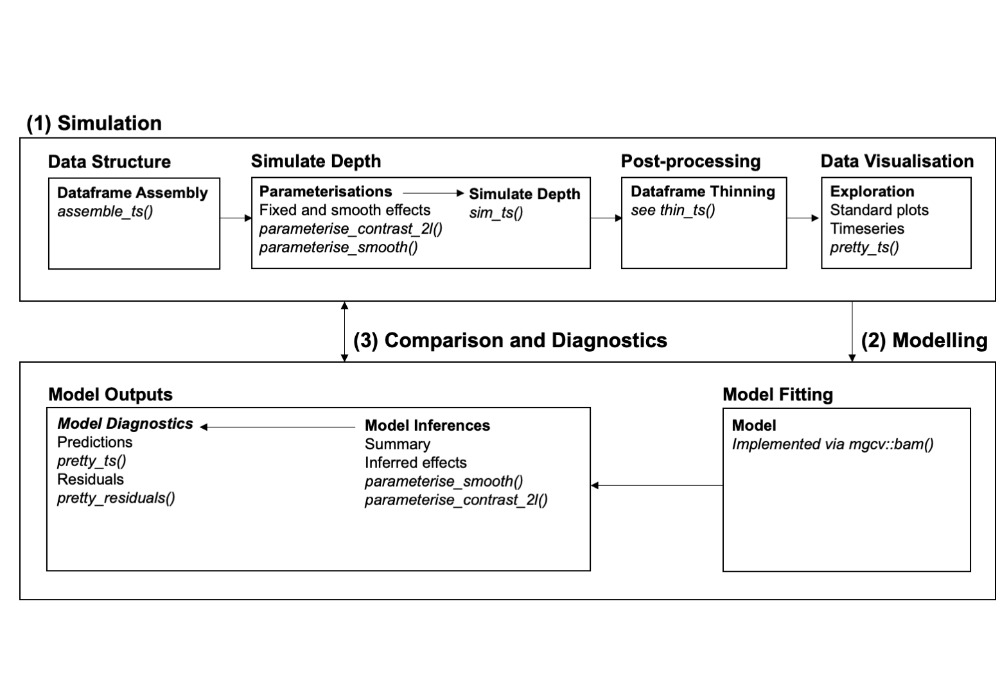

```{r, include = FALSE}
knitr::opts_chunk$set(
  collapse = TRUE,
  comment = "#>"
)
```

```{r global_options, include=FALSE}
# To force images to be where they are placed using code (as in latex)... 
# First, add this to the YAML Header: 
## header-includes:
## \usepackage{float}
# Second, type the following : 
knitr::opts_chunk$set(fig.pos = 'h')
```

<style>
body{
  width: 100%;
  height: 100%;
  font-family: TimesNewRoman;
  font-size: 12pt;
  text-align: justify;
  }
  p{
  margin-bottom: 1.2em;
  }
</style>

# Abstract

Depth-specific periodic behaviours are common in marine ecosystems. However, our understanding the drivers of these trends remains limited, in part, by available analytical techniques, which are either principally qualitative (e.g. wavelet analysis) or else require knowledge that lies outside of many ecologists' training (e.g. Hidden Markov Models). Generalised Additive Models (GAMs) strike a balance along this double-edged sword, being both a powerful modelling framework and a tool with which many ecologists are familiar, but their successful implementation requires correctly interpreting model fits and outputs, which remains challenging. Here, I present a interactive tool for the simulation and modelling of depth time series using GAMs. The tool allows the user to simulate complex depth time series according to a user-specified data-generating process that can incorporate variables commonly associated with depth in natural ecosystems (i.e., sex, body size, light levels, lunar phase, season). Simulated time series can then be modelled using GAMs to investigate (a) the extent to which models recover simulated parameters and/or functions under different simulation/model scenarios; and (b) the consequences of mis-specifying of various aspects of the simulated data-generating process within models for model outputs. This tool will facilitate ecologists to build and interpret GAMs of time series in cases where the true data-generating processes are unknown.

# Introduction

Periodic trends in depth which correlate with environmental cycles are widely observed in marine ecosystems. Indeed, the diel vertical migration (DVM) of zooplankton and fish ‘may be may be the largest natural daily movement of biomass on the planet’, but trends in depth also often correlate with other environmental cycles, including tidal, lunar and seasonal cycles [@palmer2000; @gibson2003; @naylor1999; @tessmarraible2011; @brierley2014]. Yet despite widespread recognition of these trends, our understanding of their cues and drivers remains limited [@papastamatiou2012; @schlaff2014]. However, the synergy between technological development – with the dawn of the ‘Golden Era’ for biologging and the collection of ecological time series at ever finer resolutions and over ever longer scales – and innovating modelling techniques, creates new opportunities to reveal the relationships between depth and environmental variables with more clarity and in finer detail [@papastamatiou2012; @rutz2009; @king2013; @hays2016]. 

Nevertheless, depth time series present complex statistical challenges which can require expertise that goes beyond the experience of many ecologists [@pinto2016]. One challenge is data volume, which necessitates highly optimised procedures for manipulating and modelling data [@rutz2009]. Serial autocorrelation among residuals is a related challenge that emerges when depths are sampled at high frequency [@pinto2016]. The large number of variables that may drive depth, and the complex ways in which they could interact, further complicate model specification, interpretation and diagnosis. 

In this context, many ecologists have opted for a largely qualitative approach to interrogating time series data [@scott2016]. Plots of depth and vertical activity level time series, periodograms derived from spectral decomposition, and wavelet transform coefficients from wavelet analysis are examples of approaches that have been effectively used to identify depth-specific periodic behaviours [@wearmouth2009; @humphries2016; @scott2016]. However, this largely qualitative approach limits the detail with which relationships between depth and potential covariates are separated, characterised and does not provide quantitative estimates of the extent to which they apply across individuals. Hidden Markov Models (HMMs) are an increasingly popular tool which move towards this ambition [@michelot2016]. For modelling depth time series, HMMs are particularly appealing because they assume that a hidden state (often considered a behaviour) drives the observed depth time series, and they can estimate the probability of transitioning between states based on covariates. The issue of time dependence is also tackled by the Markov chain [@michelot2016]. However, despite these appealing qualities, fitting and interpreting HMMs remains an active area of research that is beyond the training of many ecologists. 

Generalised Additive Models (GAMs) are an alternative approach. In a GAM, the response variable (depth) can be modelled as linear and smooth functions (splines) of covariates [@wood2017]. For ecologists, GAMs offer a suitable starting point for modelling trends in depth because they strike a balance between providing a quantitative framework for estimating relationships between depth and covariates whilst also being a tool with which many ecologists are familiar and have experience implementing. There are also accessible introductions [@10.7717/peerj.6876; @Simpson322248; @wood2017]. In the case of depth time series, the popular `R` package, `mgcv`, contains a function, `mgcv::bam()`, specifically designed for modelling large datasets [@wood2015; @wood2016; @wood2017; @r2018]. 

However, successfully using GAMs to model depth time series remains challenging. This is especially true when it comes to understanding the influence of post-processing on model outputs, model fitting, and the consequences of model mis-specification. For example, depth time series may be thinned prior to modelling to make them more manageable and to reduce serial autocorrelation, but the consequences of these decisions can be difficult to assess [@papastamatiou2018]. If data are not thinned, a specific issue with the `mgcv::bam()` function is that the user must specify the serial autocorrelation parameter (it is not estimated by the model), which can influence inferences [@wood2017]. Among the suite of possible model inputs, it can also be difficult to assess how well models are fitting and the consequences of specifying a model in which the assumed data-generating process differs from the true (unknown) data-generating process. 

In this context, simulations are a powerful approach that can clarify the meaning of model inputs/outputs, provide vital sanity checks of model fitting and elucidate the consequences of model mis-specification. In a simulation approach, data are simulated according to specified data-generating process and simulated data are then modelled assuming an identical or different data-generating process. Since the true data-generating process is known, the consequences of mis-specifying the true data-generating process in particular ways and to particular extents can be evaluated. To this end, a flexible tool for the simulation and modelling of time series data would go a long way towards guiding the design and interpretation of models in cases where the truth is unknown. 

Here, I present an interactive, user-friendly tool that can be used to simulate and model depth time series interactively (`GAMS4DTS`). The purpose of this document is to provide a user guide for this tool, in the hope that it will help demystify to GAMs for practising scientists and guide the cautious use of GAMs for modelling depth time series. `GAMS4DTS` is part of an `R` package which contains a suite of flexible functions for simulating, visualising and modelling ecological time series, many of which are employed ‘under the hood’ in this tool (see Reference Manual). 

# Application launch 

`GAMS4DTS` is part of the `Tools4ETS` `R` package. The function can be launched by `Tools4ETS::GAMS4DTS()`.

# Workflow 

`GAMS4DTS` employs a three phase approach to explore the use of GAMs as models for time series data, involving: (1) simulation; (2) modelling; and (3) comparison and diagnostics (Figure 1). The first stage is to simulate and visualise a depth time series. This stage involves (a) assembling a basic dataframe structure; (b) defining the covariates to influence depth and the parameters and/or functions which relate the values of these covariates to depth; and (c) using this information to simulate depth time series. Then (d) post-processing of the simulated data may be conducted and (e) simulated time series visualised. Having simulated depth time series, the next stage is to model depth time series. This stage involves (a) specifying a model structure, which may be identical to or different from that used to simulate data; and (b) examining model estimates and diagnostics. Finally, comparing simulated versus estimated parameters and/or functions in the context of model fits and diagnostics helps to elucidate the extent to which GAMs are accurately recovering the truth and, if not, why not. 

```{r, echo=FALSE, fig.cap="A summary of the workflow employed by `GAMS4DTS`. This consists of three stages: (1) Simulation; (2) Modelling; and (3) Comparison and Diagnostics. Functions available in `Tools4ETS` or `prettyGraphics` which facilitate each stage are given in italics.", out.width = '100%'}

```

# Tab-by-tab Guide

## Dataframe Assembly

The first step towards simulating and modelling depth time series is to assemble a basic dataframe structure that defines, for each individual, a sequence of timesteps and associated covariate values, at which depth can be simulated. The *Dataframe Assembly* tab displays the options for simulating depth time series and the assembled dataframe. Behind the scenes, dataframe assembly is facilitated by `assemble_ts()` (see `?Tools4ETS::assemble_ts`). 

In this tab, the user must specify:

* The date of the first observation.
* The duration, in days, over which to simulate data. This is assumed to be the same across all individuals.
* The duration, in minutes, between consecutive depth samples.
* The number of individuals for which depth time series will be simulated.

The simulated dataframe will also contain a number of covariates which can be used to drive depth and/or included in models. Currently supported covariates are sex (male, female), body size (individual length, cm), sun angle, lunar phase and Julian day (see below). To simulate the sex of each individual, body size and sun angles, the following information is also required at this stage: 

* The longitude (DD) of a hypothetical tagging location.
* The latitude (DD) of a hypothetical tagging location.
* The probability of sampling a female.
* The shape and scale parameters of a gamma distribution from which to simulate individual body sizes. 

The other arguments that `assemble_ts()` takes assume their default values. The outcome is a dataframe with the following structure: 

<table style="width:100%">
  <tr>
    <th>Variable</th>
    <th>Explanation</th>
  </tr> 
  <tr>
    <td>timestamp</td>
    <td>A time in POSIXct format, which defines each unique observation/timestep, at the specified resolution.</td>
 </tr>
   <tr>
    <td>hourofday</td>
    <td>An integer which defines the hour of day.</td>
 </tr>
   <tr>
    <td>start\_event</td>
    <td>A logical variable which defines the first observation for each individual.</td>
 </tr>
   <tr>
    <td>sex</td>
    <td>A factor which distinguishes sexes ("F" = female; "M" = male). The sex of each individual is sampled at random with a probability specified by the user. 
 </tr>
   <tr>
    <td>length</td>
    <td>A double which defines the length (cm) of each individual, simulated from a Gamma distribution with user-defined parameters.</td>
 </tr>
  <tr>
    <td>sun\_angle</td>
    <td>A double which defines the angle (degrees) of the sun relative to the horizon at the specified location and timestamp. This is derived using the suncalc package. Note: at present, sun\_angle and are derived for the single inputted location (e.g. tagging location) only.</td>
 </tr>
  <tr>
    <td>lunar\_phase</td>
    <td>A double which defines the lunar phase (rad). This is derived using the `lunar` package.</td>
 </tr>
   <tr>
    <td>julian\_day</td>
    <td>An integer which defines the number of days since January 1st.</td>
 </tr>
</table>

To begin, it is recommended that the user simulates a relatively simple dataframe structure (e.g. a short study duration, relatively low sampling resolution and one or few individuals). Once the user has successfully modelled a small dataset, this can be made progressively more complex. However, note that the application will respond progressively more slowly as the dataframe size increases (especially for very large dataframes). This means the user may have to wait a second or two (or more) to wait for a tab to respond, if the size of the dataframe is large or dramatically increased. Therefore, incremental increases in dataframe size are recommended. 

## Simulate Depth Time Series

With a user-defined dataframe structure, the next stage is to use this to simulate depths. This is a three stage process. First, the user must decide which covariates should be used to simulate depth time series. Second, for each covariate, the user must define the parameters and/or functions which relate that covariate to depth. Third, the user must provide additional information required to simulate depths. 

### Covariates 

Currently supported covariates include sex, length, sun angle, lunar phase and Julian day. Sex and length are included because sexual and ontogenetic segregation in depth are common in marine ecosystems [@wearmouth2008; @schlaff2014]. Sun angle is included as this is a continuous measure of light levels, the most common proximate cue for diel vertical migrations [@brierley2014], which is more biologically meaningful than time of day or a factor variable based on the time of sunrise and sunset (i.e. day/night). Lunar phase is also included as a continuous variable, since lunar rhythms are also widely documented [@naylor1999]. Julian day is included as a continuous measure of time of year which may help capture seasonal effects. Other environmental covariates that may influence depth, such as tidal phase, are not yet implemented.

### Parameterisations

For each covariate, the user must next define the parameters and/or functions which relate that covariate to depth (see Section 'Simulate Depths'). This is completed in the *Parameterisations* tab, in which the user can adjust these inputs and visualise their consequences until satisfied. Sex and length are implemented as fixed effects. Sex is a factor variable with two levels (male, female). To implement sex as a fixed factor, it is necessary to define the difference ('contrast') in intercept for males compared to females. Body size (length, cm) is a continuous variable. To implement length as a fixed factor, it is necessary to define the intercept and gradient of the regression of change in depth on length. Sun angle, lunar phase and Julian day are implemented smooth effects. Currently supported functions include quadratic and sigmoidal functions. 

A quadratic function is defined by four parameters, according to the equation:

\begin{equation}
f(x) = a \left( bx - h \right) ^2 + k 
\end{equation}

In this case, $f(x)$ refers to the change in depth (m) from the intercept and $x$ is the value of the covariate. $a$ and $\frac{1}{b}$ are the vertical and horizontal stretch factors respectively. If $a < 0$, the function is concave up; if $a = 0$ the function is flat such that $f(x) = k$; and if $a > 0$ the function is concave down. Larger values of $a$ above or below 0 vertically stretch the function in each direction. Conversely, if $0 < b < 1$, smaller values of $b$ result horizontally stretch the function by the factor $\frac{1}{b}$. If $b =0$, the result is a flat line, the height of which is controlled by $a$ and $k$. $h$ and $k$ are the $x$ and $y$ coordinates of the function's vertex respectively. 

A sigmoidal function is defined by three parameters, according to the equation: 

\begin{equation}
f(x) = \frac{L}{1 + e^{-K \left( x - x_{0} \right) }} - \frac{L}{2}
\end{equation}

$x_0$ is the value of the covariate ($x$) at the sigmoid's midpoint (i.e. when the change in depth $= 0$). $L$ is the expected difference in depth between the minimum and maximum values of the covariate; for example, $L = 30$ implies ± 15 m in depth between the minimum and maximum values of that covariate. Minimum and maximum values for each covariate are $-60 \le x \le 60$, $0 \le x \le 2 \pi$ and $0 \le x \le 365$ for sun angle, lunar phase and Julian day respectively. $k$ defines the steepness of the sigmoid function (i.e. how quickly depth changes with $x$); as K increases above or below 0, the steepness increases. If K = 0, the result is a flat line at y = 0, regardless of the value of $x_0$ or $L$.  

Only models which include at least one smooth effect are supported. The default option for sun angle is a sigmoidal function which reduces depth during the night when sun angle is negative and increases depth when sun angle is positive. (Depth is inputted into models as a positive number, so larger values reflect deeper depths). This reflects normal DVM. The default options for lunar phase and Julian day are symmetrical quadratic functions (since these are cyclic variables) with depth maximised at median values of those covariates. Note that while the user interface supports implementing these variables as sigmoidal functions, at present all models assume lunar phase and Julian day are cyclic variables, so using sigmoidal functions to define these effects is likely to lead to poor model fits. Also note that interactions among covariates are not yet implemented. If graphical outputs are not displayed after more than a few seconds, simply tweak the inputs slightly and graphs should appear. 

At first, it is recommended that the user retains default options for these variables (no effect of sex or length and smooth functions of sun angle, lunar phase and Julian day), and proceeds to model the depth time series using an identical data-generating process (see Section 'Model Depth'). The model should reveal correct estimates for the effect of sex and length and reasonably accurate estimates for the smooth functions (but see Section 'Model Depth'). Having established this, the next step is to change the fixed effects to investigate whether these are correctly recovered, before increasing the complexity of smooth effects. In general, it is advised to make one change at a time, evaluate the consequences, and then make further changes once the consequences are clear.  

### Simulate Depth Time Series

Having defined the covariates and the parameters and/or smooth functions which relate the value of these covariates to changes in depth, the next stage is to use these inputs to simulate depths. This is achieved in the *Simulate Depths* tab, in which the additional information required to simulate depths is inputted, and simulated depths are added to the displayed dataframe. 

To simulate depths, it is necessary to define the likelihood distribution and a link function. The only option currently implemented at this stage is a Gaussian distribution with an identity link function. This is because `mgcv::bam()` is used to fit models rapidly; this only supports a Gaussian distribution with an identity link if an AR(1) structure is included (see below). More flexible approaches (e.g. `mgcv::gamm()` and `gamlss::gamlss()`) may be added in the future. To simulate depths, the full list of required, user-specified parameters is as follows: 

* Likelihood distribution. This is the probability distribution which relates observed (simulated) depths to expected depths, given a model. For example, simulated depths ($depth$) might be assumed to be drawn from a normal distribution with a mean equal to the expected depth given the model ($\psi$) and some standard deviation ($\sigma$); i.e.:  $depth \sim N(E(depth|\psi), \sigma)$. A Gaussian distribution is the only option currently supported. 
* Link function. This is a function which maps the observed data onto a linear scale, at which model parameters are estimated. The identity link function is the only option currently supported. 
* Parameters of the likelihood distribution. Having defined a likelihood distribution, additional parameters may need to be defined. For the Gaussian distribution, the sigma parameter ($\sigma$) is required to be specified by the user (see above).
* Model intercept ($\alpha$). This is the mean depth (m) across all individuals (or, all females, if `sex` has been included as a covariate) across the time series.
* Random intercept term ($\sigma_2$). In a random intercepts model, each individual can have a different intercept, with the distribution of intercepts across individuals ($i$) around the model intercept ($\alpha$) assumed to follow a Gaussian distribution with a mean of 0 and a standard deviation of $\sigma_2$ specified by the user, i.e., $\delta_{alpha, i} \sim N(0, \sigma_2)$.
* Serial autocorrelation parameter ($\rho$). In models, there is usually variation around the expected value of the response variable (residual variation, $\epsilon$). In a simple model with a Gaussian likelihood, this residual variation is assumed to be normally distributed and the extent of this variation is captured by the $\sigma$ parameter (see above). However, in models of time series, especially those in which the response variable has been observed at high frequency, there is often a correlation between the residual at one timestep and previous timesteps. In an autoregressive order 1 (AR1) model, the residual variation is partitioned into two components: a deterministic component that depends on the correlation ($\rho$) between the residual at one time step and the previous timestep ($\epsilon_{t-1}$), and a stochastic component that relates to the current timestep ($\sigma$). Thus, the simple model above, $depth \sim N(E(depth|\psi), \sigma)$, becomes $depth \sim N(E(depth|\psi)+ \rho \epsilon_{t-1}, \sigma)$. This is the only correlation structure currently supported by `GAMS4DTS`.

These inputs are used to simulate depths using the `sim_ts()` function. In a model with a Gaussian likelihood, the assumption is that the depth of individual $i$ at timestep $t$ is drawn from a Gaussian distribution, defined by parameters $\mu_{i, t}$ and $\sigma$; i.e.: 

\begin{equation}
depth_{i, t} \sim N \left( \mu_{i, t}, \sigma \right)
\end{equation}

$\mu_{i, t}$, the expected depth of individual $i$ and time $t$ depends on the value of the model intercept (defined by the user), a random effect for individual (if defined by the user), and the partial effects of each covariate inputted (e.g. sex, length, and smooth covariates), according to the equation: 

\begin{equation}
\label{eq-depth}
\mu_{i, t} = g^{-1} \left( \alpha + \delta_{alpha, i} + \emptyset_i \delta_{alpha, M} + \beta length_i + \sum_{j = 1}^{J} s_j \left(x_{j, t} \right) \right) + \rho e_{i, t-1}
\end{equation}

where $g^{-1}$ is the inverse link function, $\alpha$ is the model intercept and $\delta_{alpha, i}$ is the difference from the intercept for individual $i$. The distribution of differences in intercepts across individuals assumed to follow a Gaussian distribution with a mean of 0 and a standard deviation ($\sigma_2$) specified by the user, i.e., $\delta_{alpha, i} \sim N(0, \sigma_2)$. $\emptyset_i$ is an indicator variable which takes a value of 0 or 1 if individual $i = "F"$ or $i = "M"$ respectively and $\delta_{alpha, M}$ is the difference in intercept for males compared to females. $\beta$ is the coefficient of the partial regression of $\mu$ against $length$. $\sum_{j = 1}^{^J} s(x_{j, t})$ refers to the sum of the smooth functions, $s()$, of each covariate $x_j$ implemented with a smooth function, evaluated at time $t$, from the first covariate $(j = 1)$ to the final covariate $j = J$. $\rho$ is a parameter which describes the serial correlation between the residual at time $t$ and time $t-1$; i.e., $\epsilon_{i, t-1}$: 

\begin{equation}
\epsilon_{i, t-1} = depth_{i, t-1} - \mu_{i, t-1}
\end{equation}

Note that $\epsilon_{i, t=1}$ is defined such that $\epsilon_{i, t=1} = 0$. 

## Thin Depth Time Series

To reduce dataset size and/or the extent of serial autocorrelation in datasets in which depth has been observed at high frequency, a common approach is to 'thin' the dataset. There are a few different methods that can be used to thin time series, but their consequences for model fitting are rarely evaluated in applied settings. In the *Thin Depth Time Series Tab*, the user can decide whether or not to thin the time series and, if so, how to thin the time series and by how much. This functionality is provided by a customised version of `thin_ts()`. Three methods are currently implemented for thinning: the static window average, the simple moving average and systematic point selection. 

1. Static window average. Under the static window average approach, depth observations are averaged over every $n$ minutes. To implement this option, the user must define the new interval between depth simulations, which should be greater than the simulated duration between observations. The simulated dataframe is partitioned into windows of the specified size and, for each window, the mean depth is calculated. Temporal covariates are recalculated for the new window and added back into the time series. 

2. Simple moving average. A limitation with the static window average approach is that each influence of each observation on the new, recalculated depth values is weighted equally. For comparison, simple moving averages can be implemented (although this method is currently implemented without thinning). Under this approach, averages are weighted so that the influence of each observation diminishes with the temporal distance between observations. This may be useful in some circumstances to remove 'noise' around each observation to facilitate the identification of long-term trends. Simple moving averages are implemented using `smooth::sma()`; user-specified options are not implemented at present. This approach should be used with caution for large datasets because it can be slow. 

3. Systematic point selection. The final option is systematic point selection. Under this approach, the user selects every $n$ observations (and accompanying covariate values). 

To begin, it is recommended that the user first leaves thinning turned-off, until satisfied that the model correctly estimates simulated inputs. Then, this option can be turned on or off to compare the results of models of the full versus thinned/smoothed dataframes using the different approaches implemented. For example, it may be instructive to compare how model-estimated smooths differ from simulated smooths under different thinning methods depending on the amount of simulated data, or how effective the different thinning methods are at reducing simulated serial autocorrelation. 

## Visualise Simulated Data

Once the dataset has been simulated and post-processing completed, as necessary, it is good practice to visualise simulated data. The *Visualise Simulated Data* highlights basic statistics (such as the number of individuals of each sex simulated, if sex has been included as a covariate), relationships among variables and plots of depth and temporal covariate time series. The latter are created using the `pretty_ts()` function. This is a flexible function which can plot any covariate against time and, if specified, add a second covariate to the plot, either by colouring the first variable's time series or by the addition of a second axis. 

## Define Model 

The user has now simulated a depth time series dataset. The next step is to define a model for this time series. This stage is completed in the *Define Model* Tab. In this tab, the user is presented with a similar set of options as in *Simulate Depth*: it is necessary to define the likelihood distribution, the link function and the covariates to be included in the model. Length, sun angle, lunar phase and Julian day are implemented as smooth functions. By default, length and sun angle are implemented as a shrinkage thin plate regression splines ($bs = 'ts'$), but this can be adjusted. The basis functions for lunar phase and Julian day are fixed as cyclic smooths ($bs = 'cc'$), with knots defined at $(0, 2 \pi)$ and $(0, 365)$ respectively. (For Julian day, note that this does not account for leap years.) For all smooth effects, the number of knots can be adjusted. The user also needs to specify whether or not to include a random effect for individual and the serial autocorrelation parameter. The latter is necessary because `mgcv::bam()`, from the `mgcv` `R` package, is used to fit all models [@wood2015; @wood2016; @wood2017]. This function is used because it is optimised for large datasets, which is often the case with depth time series. 

At first, it is advised to keep the model identical to the truth (i.e. what has been simulated), to check whether inferences match expectations. Then, the user can start to make the data-generating process assumed by the model progressively more different from the simulated data-generating process to explore the consequences of model mis-specification. Remember, in reality, the truth data-generating process is unknown, so this process can help with model interpretation in cases where the truth is unknown.

For small datasets, `mgcv::bam()` should fit models within a second. For large datasets, it may take seconds for the model to fit. Once model fitting is completed, the likelihood distribution, link function, model formula, estimated degrees of freedom and fREML score are shown (see below). Pay particular attention to the model formula to check the data-generating process assumed by the model versus that used to simulate the data. 

## Model outputs

### Model Summary

With a model that has successfully run, the next step is to examine model outputs. First, The *Model Summary* tab provides the output of the `base::summary()` function. The model family, link function and formula have already been displayed in the previous tab. Here, first examine the estimates for the parametric coefficients. Have they been correctly estimated? How well has the model recovered these? Next, examine the approximate significance of smooth terms, the model deviance and other terms provided. 

### Model Covariate Plots

The *Model Covariate Plots* visualises simulated and recovered parameters and/or smooth functions relating depth to the covariates included in the model. Simulated outcomes are shown in grey. Predicted relationships are shown in black. For covariates that were not included in simulations but were included in models, a flat line (i.e. no relationship) is shown. If model predictions are are not visible on top of what has, in effect, been simulated (i.e. no effect of that covariate on depth), this is because the model is very confident that there is, in fact, no relationship and the almost identical fitted line is being obscured by the simulated line. Try increasing the variance (e.g. in a model with a Gaussian distribution, the $\sigma$ parameter). The model's confidence in fitted relationships is likely to decrease and the fitted line, surrounded by 95 % confidence intervals or pointwise bands for fixed and smooth effects respectively, should become visible. 

The user also has the option to display partial residuals on smooth plots. On any given smooth plot, partial residuals are the differences between simulated depths and expected depths (given the model) across the values of that covariate, whilst holding other covariates constant. (Note that interactions among covariates are not currently supported.) The extent and distribution of variation of partial residuals around the fitted line can help indicate how much variation a covariate explains and its biological importance, and how well the model is fitting to the data. Systematic deviations of partial residuals from the fitted line should raise alarm bells. The user is advised to select this option for small datasets. However, for large datasets, the volume of partial residuals may make it difficult to discern patterns and plots may take some time to appear. All confidence intervals/pointwise confidence bands represent ± 2 standard errors. 

### Model Predictions

While model covariate plots, like those presented in *Model Covariate Plots* are often published in the ecological literature, plots of the raw data, together with model predictions are less often published. Yet these are crucial for assessing how well a model is fitting the data, the extent to which the model explains observed trends and systematic biases. In the *Model Predictions* tab, the user can view plots of the simulated and predicted depth time series for any selected individual. The black line is the true, simulated depth time series. The grey line is the fitted depth time series and the grey envelope represents the 95 % confident intervals around the fitted line. 

### Model Diagnostics 

The *Model Diagnostics* tab provides further information on model diagnostics. These are used to visualise whether the assumptions of the model are violated. Four standard diagnostic plots are usually considered. The validity of the assumption of particular error structure for the residuals can be visualised using quantile-quantile plots and histograms of the model's residuals. The assumption that the variation is constant with the mean can be visualised in a plot of residuals ~ the linear predictor, and the correlation between the response and fitted values can be visualised by a plot of response ~ fitted values. It is also instructive to plot residuals ~ covariates (including timestamps) and the autocorrelation function of residuals. The latter two plots are used to indicate whether autocorrelation needs to be included in the model. 

For models in which an autocorrelation parameter has been included, standard residual plots, based on deviance residuals, are no longer appropriate because they do not account for the autocorrelation included in the model. Therefore, plots of 'unstandardised' residuals will continue to look troublesome. However, plots of standardised residuals, which are approximately uncorrelated under the correct model, should look reasonable. In models with autocorrelation, diagnostic plots of both unstandardised (on the left) and standardised residuals provided by `mgcv::bam()` (on the right) are shown for comparison. Thus, the contents of this tab differ depending on whether or not autocorrelation has been simulated and/or modelled: 

1. No simulated or modelled autocorrelation. In the section, `gam.check()`, text-based output of `mgcv::gam.check()` is reported. In the section, `Residuals Diagnostic Plots`, a large number of residuals plots are produced, including a histogram of residuals, a quantile-quantile plot, plots of the residuals against the fitted values and the linear predictor, plots of the residuals against possible covariates (including time) and an autocorrelation function of the residuals. All plots are based on deviance residuals. 

2. Simulated but not modelled correlation. The tab is identical to the scenario above, but some diagnostics may start to look troublesome. For example, the residuals ~ timestamp plot may look concerning and the ACF will show some serial autocorrelation. The estimated $\rho$ at lag one should be close to the simulated $\rho$ value. 

3. Simulated and modelled correlation. Diagnostic plots are now shown for both unstandardised (on the left) and standardised (on the right) residuals. Diagnostic plots based on unstandardised residuals should look troublesome while plots based on standardised models should look reasonable if the model has successfully captured the simulated serial autocorrelation. 

For models of large time series, it can be difficult to use graphical approaches to visualise residuals. Therefore, residual plots can be plotted for particular individuals. Random subsets of residuals (or a user-defined size) can also be plotted to aid interpretation. 

# Example uses

`GAMS4DTS` helps to demonstrate the meaning of model parameters and the consequences of various data collection, post-processing and modelling decisions. Example questions, asked by the ecologist, that can be addressed with `GAMS4DTS` include: 

* How effectively can smooths of a particular variable (e.g. sun angle) be recovered from data simulated at different resolutions and different lengths? 
* What are the consequences of autocorrelation for model fits? 
* How well is the autocorrelation parameter estimated from the ACF of residuals? How does this depend on the volume of data available? 
* How sensitive are model fits to the mis-specification of the autocorrelation parameter? 
* What are the effects of different thinning methods on estimated smooths and autocorrelation? 
* How much thinning is required to remove a given amount of autocorrelation? 
* How much data are required to resolve the effect of covariates that operate at different temporal scales (e.g. sun angle versus lunar phase)? How does this depend on the magnitude of the simulated ('true') effect and the extent of autocorrelation? 
* What are the consequences of missing important variables for model fits and diagnostics? 

# Cautions 

## Blank tabs 

The reactive user interface responds quickly but, in some cases, tab items may take a second (or more) to materialise or update. This is especially true for large datasets (see below) and if the user switches between making changes in the first few tabs and observing their consequences in the final few tabs. For example, if a change is made in *Data Assembly* and then the user flicks back to *Model Predictions*, intermediate steps (e.g. running the model) have to occur behind the scenes before the current tab is updated. 

## Large datasets 

Simulating large datasets will slow the application down. With a large dataset, subsequent user inputs take longer to be processed; this means that the user may have to wait for several seconds (or more) for the interface to change. For very large  datasets, models in particular may take minutes to run and visualisations may also be slow to respond. As an approximate rule of thumb, for dataframes with more than 50,000 rows, a stepwise approach to further increases in dataframe size is advised, with sequential increases no more than doubling the dataframe size compared to the previous simulation. The user is advised to move sequentially from one tab to the next, observe that the steps in each tab have been successfully completed, before moving on. Wait for tabs to respond before making subsequent changes. In extreme cases, if the user interface is unresponsive, simply restart the app and reduce the dataframe size before continuing. 

## Transient error messages

Red error messages may quickly appear and disappear before outputs appear. Normally, this is not a concern: it simply reflects the initiation of underlying functions before user-defined inputs are recognised (i.e., the reactive environment has not 'caught up with itself'). When this occurs, empty inputs are passed to the underlying functions, resulting in an error message, before the user-defined inputs are then recognised, passed to underlying functions, and desired outputs displayed. If this occurs, the user is advised to wait a second or two for desired outputs to display. 

## Persistent error messages

Persistent error messages are more concerning. To resolve these, the first check is to make sure all of the inputs boxes are filled (i.e. no blanks). It may be necessary for the user to backtrack through the tabs to check there are no error messages which precede the error message in question. For example, accidentally deleting all values from  the box 'Define the number of individuals for which you will simulate data' in *Dataframe Assembly* will lead to error messages on most subsequent tabs, the cause of which is in *Dataframe Assembly*. Users should contact the author if they receive persistent error messages that are not resolved by this check.

# Future developments

The first version of `GAMS4DTS` aimed to provide a basic tool for ecologists to gain familiarity with GAMs and to explore some important questions regarding the consequences of data structure, post-processing and modelling structure for ecological inferences. However, simulated datasets and models are generally simpler than in practice. This additional complexity raises many more questions for the ecologist. 

In terms of the consequences of data structure, these questions include: 

  * What are the consequences of individuals with time series of variable length for model fitting? 
  * What are the consequences of gaps in the time series for model fitting? 
  * What are the consequences of the timing of individual time series for model fitting? 

In terms of model structure, these questions include: 

  * How do the outputs of `mgcv::bam()` and `mgcv::gamm()` compare? 
  * What are the consequences of mis-specifying the autocorrelation structure? 

To address these questions, future developments aim make `GAMS4DTS` more flexible, in terms of data simulation (e.g. species-specific body size parameters, time series of different lengths for different individuals) and modelling (e.g. different model implementations, such as `mgcv::gamm()`, error distributions and correlation structures; and interaction terms). Suggestions are welcome. 

# Acknowledgments

This work was conducted during a PhD Studentship at the University of St Andrews, jointly funded by Scottish Natural Heritage and the Centre for Research into Ecological and Environmental Modelling, and supported by additional funding for Shark Guardian. EL is a member of the Marine Alliance for Science and Technology Graduate School. `GAMS4DTS` was written in `R` (https://www.r-project.org) using the `RStudio` interface (https://www.rstudio.com). `GAMS4DTS` is powered by `Shiny` (https://shiny.rstudio.com) and hosted on shinyapps.io (https://www.shinyapps.io). This Vignette was written using `Rmarkdown` (https://rmarkdown.rstudio.com). 

# References 

